# Semana 1 - Bitácora Tecnica

> **Objetivo:** Practicar operaciones con Streams y afianzar GitFlow en el flujo de trabajo.

## Ejercicio 1
- Filtrar pares > 10: `src/main/java/dosw/bitacora/Semana1/Streams/StreamsEjercicio1.java`
    
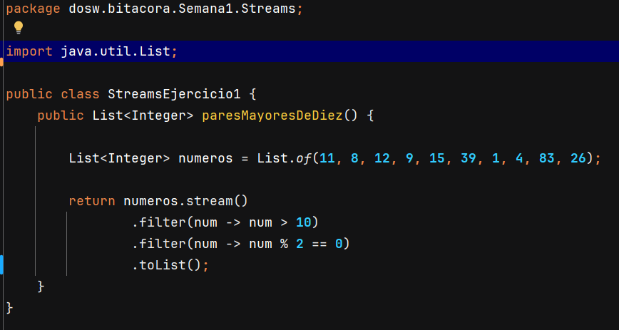

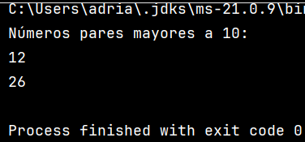

## Autoevaluación
**¿Qué entendía mal antes?**
- Pensaba que había que hacer bucles complicados para filtrar, y que Streams era solo “otra forma de for”.

**¿Qué entiendo ahora?**
- Streams permite describir qué queremos de la lista, sin preocuparnos por recorrerla paso a paso.

**¿Qué me falta reforzar?**
- Combinar varios filtros, map y reduce para ejercicios más complejos.

## Ejercicio 2 
- Palabras (>4), MAYUS, sort, count: `src/main/java/dosw/bitacora/Semana1/Streams/StreamsEjercicio2.java`

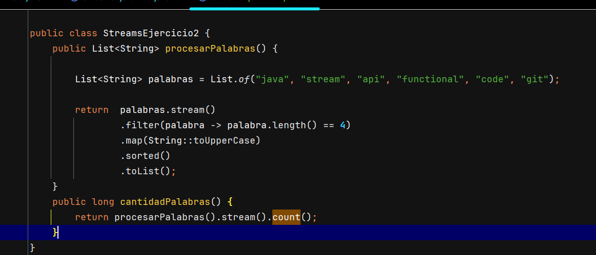

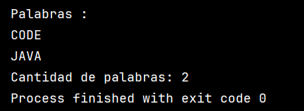

## Autoevaluación
**¿Qué entendía mal antes?**
- No tenía claro para qué servía map.

**¿Qué entiendo ahora?**
- filter elimina elementos y map transforma cada elemento.

**¿Qué me falta reforzar?**
- Entender mejor el uso de las operaciones terminales.

## Ejercicio 3
- Usuarios activos → nombres MAYUS sorted: `src/main/java/dosw/bitacora/Semana1/Streams/StreamsEjercicio3.java`

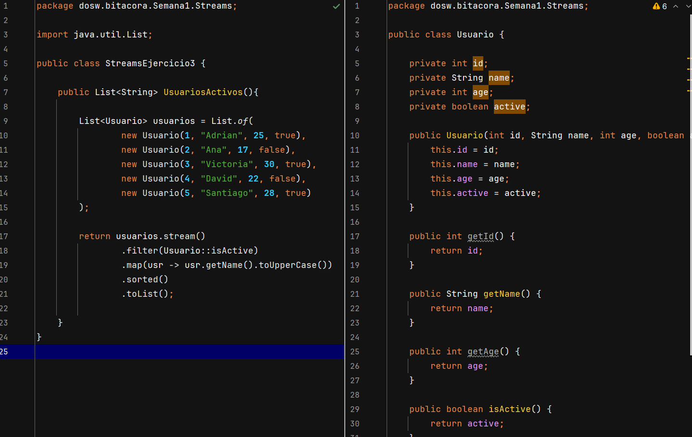

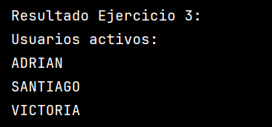
## Autoevaluación
**¿Qué entendía mal antes?**
- Pensaba que siempre trabajaba con el mismo tipo de objeto durante el stream.

**¿Qué entiendo ahora?**
- map transforma el tipo de dato, en este caso de Usuario a String (nombre).

**¿Qué me falta reforzar?**
- Encadenar varios map y entender mejor cómo cambia el tipo del stream.

## Ejercicio 4
- Usuarios mayores de edad → nombres: `src/main/java/dosw/bitacora/Semana1/Streams/StreamsEjercicio3.java`

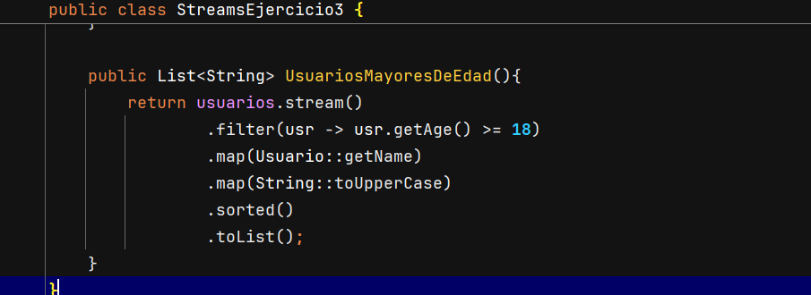

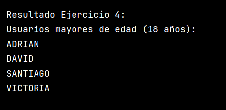
## Autoevaluación
**¿Qué entendía mal antes?**
- Pensaba que debía cambiar todo el stream para otro criterio.

**¿Qué entiendo ahora?**
- Solo cambia la condición del filter, la estructura del stream es la misma.

**¿Qué me falta reforzar?**
- Combinar varios filtros en un mismo stream.

## Ejercicio 5
- Transacciones: `src/main/java/dosw/bitacora/Semana1/Streams/StreamsEjercicio5.java`

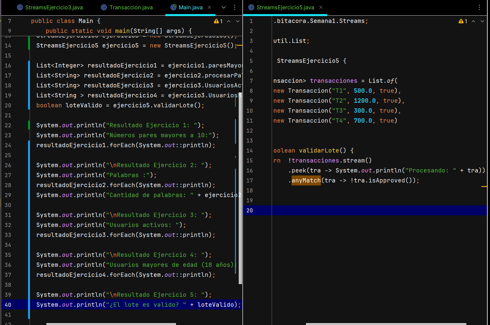

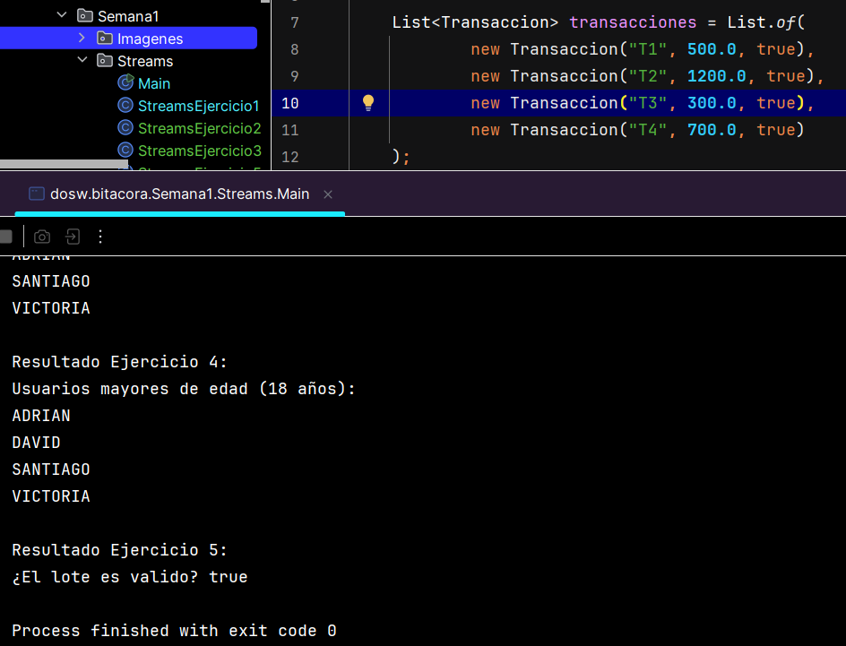

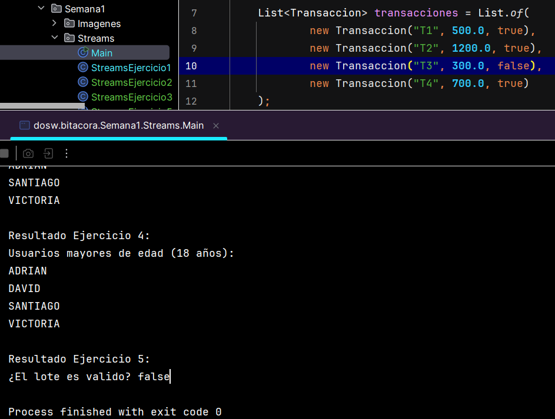

## Autoevaluación
**¿Qué entendía mal antes?**
- Pensaba que Streams solo servía para devolver listas.

**¿Qué entiendo ahora?**
- Que los streams son declarativos: describo qué quiero, no cómo recorrerlo.

**¿Qué me falta reforzar?**
- Necesito practicar más la construcción de streams complejos sin guía, mejorar mi comprensión de lambdas y 
fortalecer mi lógica a la hora de empezar de ceros.

