# Semana 3 - Bitácora Técnica

> **Objetivo:** SOLID y Patrones de Software Parte 2

## Resumen de patrones trabajados

1. Factory Method (Creacional)

**¿Qué hace?**
- Permite crear objetos sin especificar exactamente qué clase concreta se va a instanciar. 
- La creación se delega a subclases.

Idea clave: Separar qué se crea de cómo se crea.

Ejemplo real:
- Cuando pides una bebida en una cafetería, no sabes cómo la preparan internamente. Solo dices: “Quiero un café”. La 
cafetería decide si usar máquina espresso, prensa francesa, etc.

Cómo imaginarlo:
Una “fábrica” que decide qué objeto crear dependiendo del contexto.

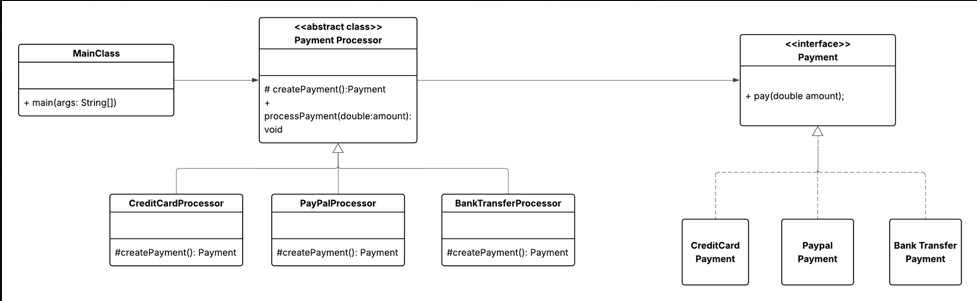

2. Abstract Factory (Creacional)

**¿Qué hace?**
- Permite crear familias de objetos relacionados sin especificar sus clases concretas.

Idea clave: Crear productos que pertenecen a una misma “familia”.

Ejemplo real:
Una empresa de videojuegos:
- Xbox → crea control Xbox + juego Xbox
- PlayStation → crea control PS + juego PS

No puedes mezclar control Xbox con consola PlayStation.

Cómo imaginarlo:
Una fábrica que produce kits completos compatibles entre sí.

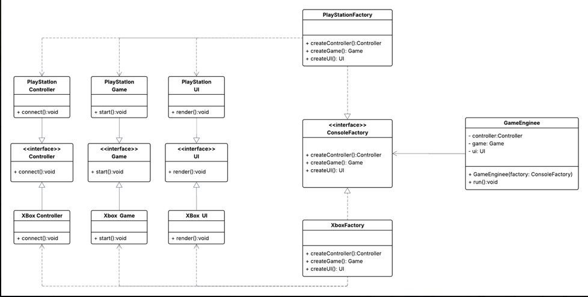

3. Builder (Creacional)

**¿Qué hace?**
- Permite construir objetos complejos paso a paso.

Idea clave: Separar la construcción del objeto de su representación final.

Ejemplo real:
Armar una hamburguesa:
- Pan
- Carne
- Queso
- Salsas

Dependiendo de lo que agregues, cambia el resultado final.

Cómo imaginarlo:
Como un configurador donde eliges piezas hasta formar el producto final.

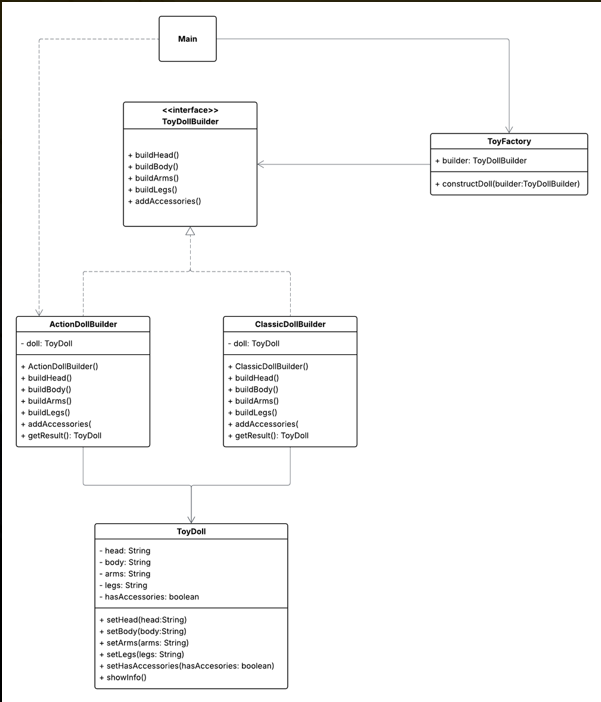

4. Adapter (Estructural)

**¿Qué hace?**
- Permite que dos clases incompatibles trabajen juntas.

Idea clave: Traducir una interfaz a otra.

Ejemplo real:
- Un adaptador de enchufe cuando viajas a otro país.
Tu cargador no cambia, pero el adaptador permite que funcione.

Cómo imaginarlo:
Un traductor entre dos sistemas que no se entienden directamente.

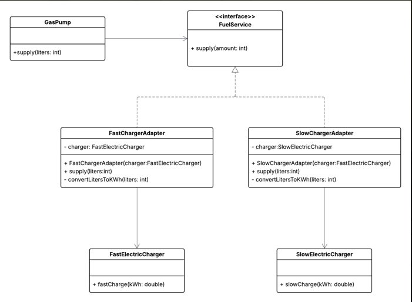

5. Bridge (Estructural)

**¿Qué hace?**
- Separa una abstracción de su implementación para que ambas puedan cambiar independientemente.

Idea clave: Evitar explosión de clases cuando combinamos cosas.

Ejemplo real:
Figuras (círculo, cuadrado) y colores (rojo, azul).
En vez de crear:
- CírculoRojo 
- CírculoAzul
- CuadradoRojo
- CuadradoAzul

Se separa Figura y Color.

Cómo imaginarlo:
Un puente entre dos dimensiones que pueden variar por separado.

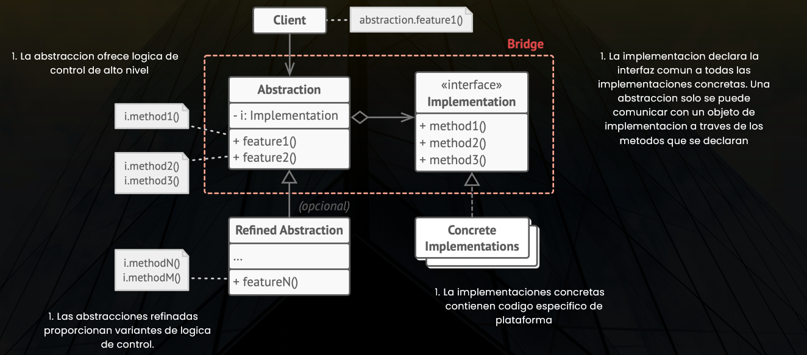

6. Composite (Estructural)

**¿Qué hace?**
- Permite tratar objetos individuales y grupos de objetos de la misma forma.

Idea clave: Estructura tipo árbol.

Ejemplo real:
Una carpeta en tu computador:
- Puede contener archivos.
- Puede contener otras carpetas.
- Todo se trata como “elemento”.

Cómo imaginarlo:
Un árbol jerárquico donde todo tiene el mismo tipo base.

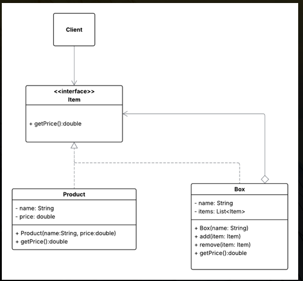

7. Decorator (Estructural)

**¿Qué hace?**
- Permite agregar funcionalidades a un objeto sin modificar su clase original.

Idea clave: Añadir comportamiento dinámicamente.

Ejemplo real:
Un café:
- Café básico
- Café + leche
- Café + leche + caramelo

No creas una clase nueva cada vez, solo lo “decoras”.

Cómo imaginarlo:
Capas que se van agregando encima de algo base.

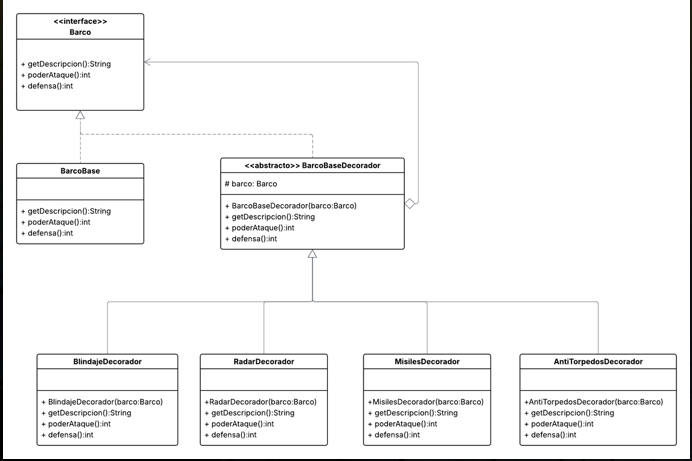

8. Chain of Responsibility (Comportamiento)

**¿Qué hace?**
- Pasa una solicitud por una cadena de objetos hasta que uno la maneje.

Idea clave: Desacoplar quién envía la solicitud de quién la procesa.

Ejemplo real:
En una embajada:
- Recepcionista
- Supervisor
- Director

Si uno no puede resolverlo, lo pasa al siguiente.

Cómo imaginarlo:
Una fila de personas donde el problema avanza hasta resolverse.

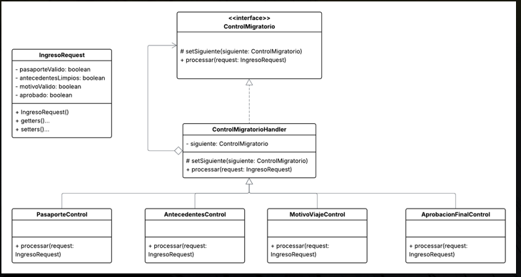

9. Command (Comportamiento)

**¿Qué hace?**
- Encapsula una solicitud como un objeto.

Idea clave: Convertir acciones en objetos.

Ejemplo real:
Un control remoto:
- Botón ON
- Botón OFF

Cada botón es un comando que ejecuta una acción.

Cómo imaginarlo:
Una orden guardada dentro de un objeto.
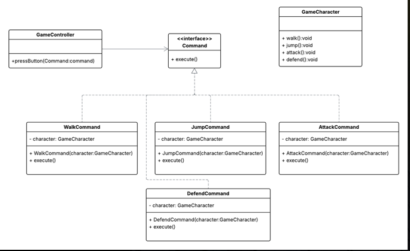

10. Strategy (Comportamiento)

**¿Qué hace?**
- Permite cambiar el algoritmo que usa un objeto en tiempo de ejecución.

Idea clave: Variar comportamiento sin cambiar la clase principal.

Ejemplo real:
Aplicación de navegación:
- Ruta más rápida 
- Ruta más corta
- Evitar peajes

El GPS cambia la estrategia según lo que elijas.

Cómo imaginarlo:
Un mismo problema con diferentes formas de resolverlo.

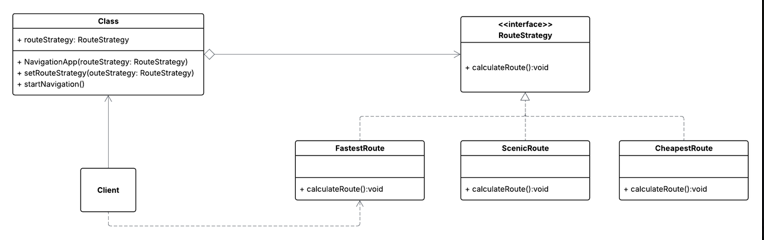

11. Memento (Comportamiento)

**¿Qué hace?**
- Permite guardar y restaurar el estado anterior de un objeto sin violar su encapsulamiento.

Idea clave: Función “deshacer”.

Ejemplo real:
Ctrl + Z en Word.

Cómo imaginarlo:
Una cápsula que guarda una foto del estado actual para volver atrás.

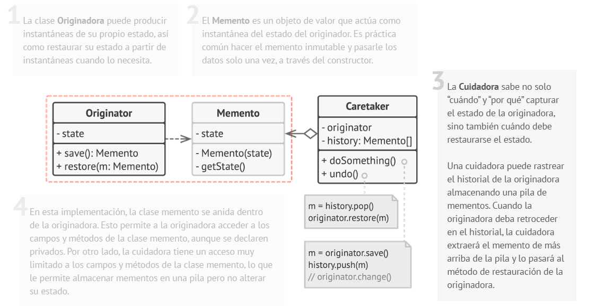

12. Iterator (Comportamiento)

**¿Qué hace?**
- Permite recorrer una colección sin exponer su estructura interna.

Idea clave: Acceso secuencial controlado.

Ejemplo real:
Un guía turístico recorriendo puntos de una ciudad uno por uno.

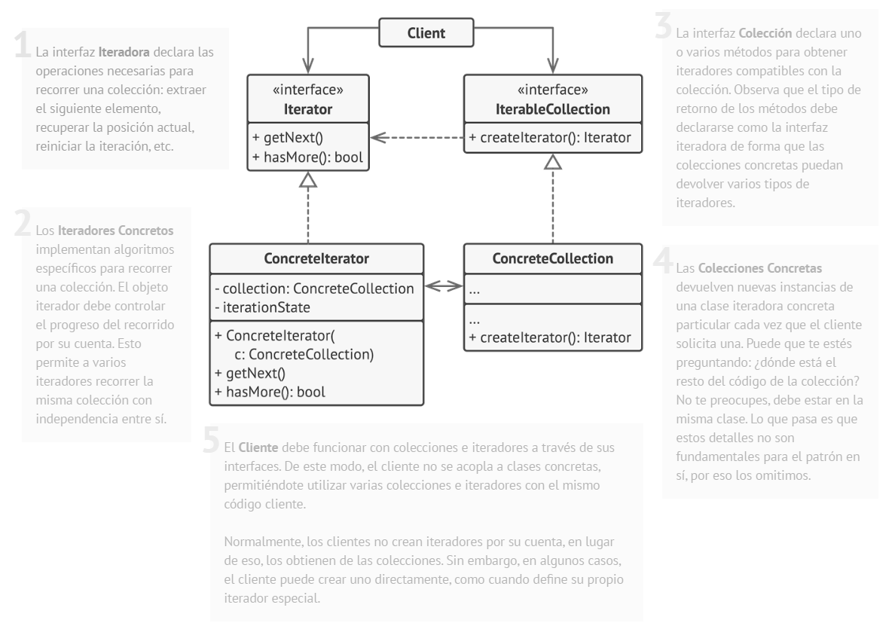

## Cómo imaginarlo:

Un cursor que avanza elemento por elemento.   
🧠 Forma rápida de recordarlos para examen  
🏭 Crear objetos → Factory / Abstract Factory / Builder  
🔌 Conectar cosas incompatibles → Adapter  
🌉 Separar dimensiones → Bridge  
🌳 Estructura jerárquica → Composite  
🎨 Agregar funcionalidades → Decorator  
📩 Pasar responsabilidades → Chain  
🎮 Encapsular acciones → Command  
🧭 Cambiar algoritmo → Strategy  
💾 Guardar estado → Memento  
🔁 Recorrer colección → Iterator

## Autoevaluación
**¿Qué entendía mal antes?**

- Antes veía los patrones de diseño como algo teórico o innecesariamente complejo. No entendía realmente por qué 
existían ni cómo ayudaban a estructurar mejor el código.
- Pensaba que crear objetos directamente con new era suficiente y no veía la necesidad de delegar la creación a una 
fábrica.
- Tampoco comprendía bien la diferencia entre Factory y Abstract Factory, ni la razón de manejar tantas clases en este 
último.

**¿Qué entiendo ahora?**
- Ahora entiendo que un patrón de diseño es una solución estándar a problemas comunes en el desarrollo de software y 
que ayuda a mantener el código organizado, extensible y mantenible.
- Comprendo que:
  - Factory delega la creación de objetos a una clase especializada.
  - Abstract Factory permite crear familias de objetos relacionados, aunque todavía me parece más complejo por la 
  cantidad de clases involucradas.
  - Builder organiza la construcción de un objeto paso a paso siguiendo una secuencia específica.
  - Las interfaces juegan un papel clave en los patrones porque permiten generalizar comportamientos sin depender de 
  clases concretas.
- También entiendo mejor el flujo del programa cuando se aplica un patrón, ya que el problema se resuelve de manera más 
estructurada y con opciones claras.

**¿Qué me falta reforzar?**
- Comprender completamente el patrón Abstract Factory y sentirme cómodo explicándolo sin apoyo.
- Mejorar mi lógica al momento de implementar un patrón sin depender tanto del diagrama.
- Practicar más para no olvidar la estructura de cada patrón.
- Fortalecer la creación de mis propios diagramas UML, no solo interpretarlos.
- Consolidar la relación entre diseño y lógica para que mis implementaciones no solo sigan el diagrama, sino que también
tengan coherencia funcional.

# Ejercicio en clase mi producto
**Nombre y Slogan**

Silent for me by DUCU

La cancelación de sonido es tu decisión en cualquier situación.

**Publico Objetivo**

Para esos jóvenes y adultos entre los 13 y 40 años que se desean concentrarte
en lo que están escuchando.

**Paleta de colores**

- Rojo: El rojo representa la fuerza del sonido, la potencia y la emoción que transmite la música.
Es un color que llama la atención y genera impacto visual inmediato, por eso se utiliza principalmente en las siglas DU,
convirtiéndolas en el punto focal del logo.
Además, el rojo conecta muy bien con el público objetivo (13 a 40 años), ya que transmite dinamismo, juventud y carácter.

- Negro: El negro simboliza sofisticación, tecnología y potencia sonora.
En productos tecnológicos, el negro suele asociarse con calidad premium y rendimiento. En nuestra maraca DU, el negro 
aporta contraste, modernidad y una sensación de aislamiento.

- Azul: El azul representa la tecnología, estabilidad y control del sonido.
Se utiliza en elementos como la onda sonora o detalles secundarios para comunicar precisión técnica y confiabilidad.
Es un color que equilibra la intensidad del rojo y refuerza la idea de un producto moderno y tecnológico.

- Gris: El gris funciona como color de apoyo. Representa equilibrio, neutralidad y diseño limpio. Permite que el rojo y 
azul resalten sin saturar la composición.

**Tipografía**

La tipografía ALGERIAN fue seleccionada porque transmite fuerza, carácter, presencia e impacto visual. Sus trazos 
marcados y estructura sólida proyectan una personalidad dominante y segura, alineada con el concepto de potencia sonora 
y decisión individual. Dado que el eslogan es “La cancelación de sonido es tu decisión en cualquier situación” la 
tipografía refuerza esa idea de firmeza y determinación. Además genera recordación visual y aporta identidad propia y 
personalidad fuerte a la marca.

**Imágenes Utilizadas**
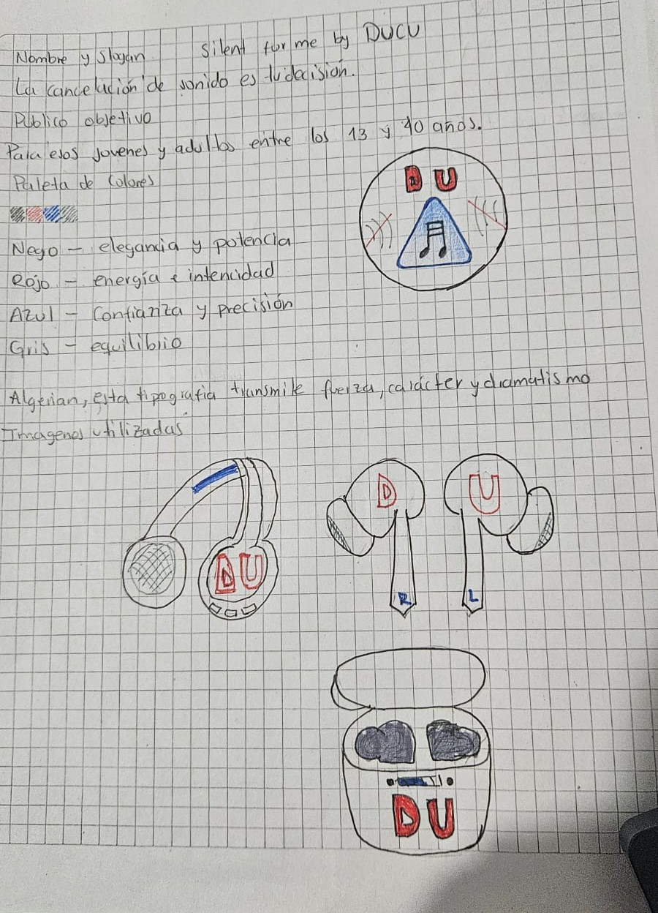
**Resultado grafico**
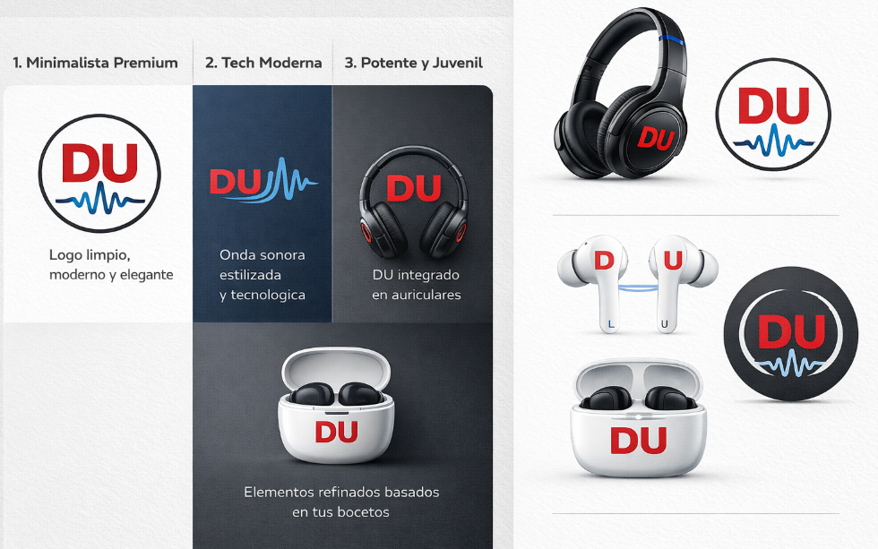
Imágenes generadas con ayuda de AI.
