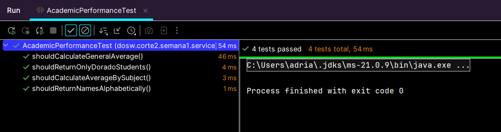

# Bitácora Semana 1 - Corte 2

## Actividades realizadas

- Implementación de ejercicios de programación funcional con Streams.
- Creación de modelos Student y Grade.
- Implementación de clase AcademicPerformance para análisis de datos.
- Uso de Apache Maven para estructura del proyecto.
- Creación de pruebas unitarias.

---

## Dificultades encontradas

- Comprensión del uso de flatMap en Streams.
- Manejo de agrupaciones con Collectors.groupingBy().

---

## Tiempo estimado vs tiempo real

Tiempo estimado: 2 días

Tiempo real: 3 días

---

## Reflexión sobre gestión del tiempo

La implementación tomó más tiempo del esperado debido a la complejidad de los ejercicios con Streams, especialmente los relacionados con agrupaciones y cálculos de promedios.

---

### Capturas

